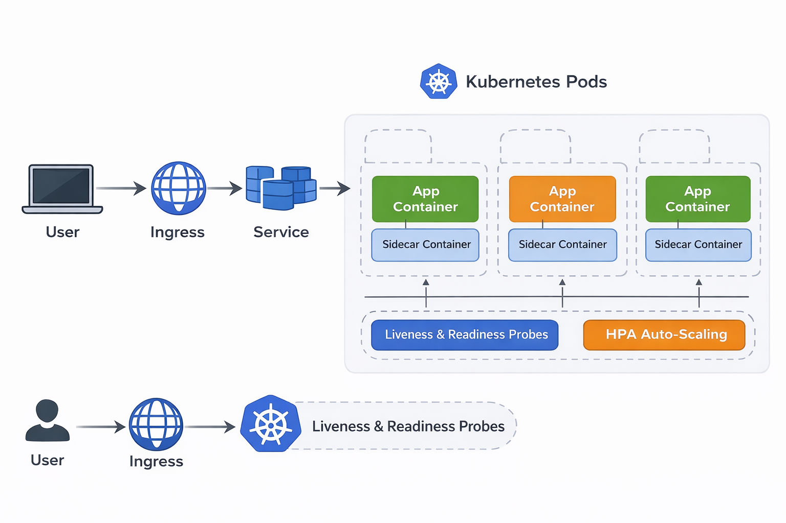

# 🚀 Kubernetes Microservices Platform

A practical DevOps project demonstrating deployment, scaling, and management of a containerized FastAPI application using Kubernetes.

---

## 🏗️ Architecture

```text
User → Ingress → Service → Pods → Container
```


---

## ⚙️ Implementation (Steps + Commands)

### 1. Start Cluster

```bash
minikube start --driver=docker
kubectl get nodes
```

### 2. Build Docker Image

```bash
eval $(minikube docker-env)
docker build -t fastapi-app:latest .
```

### 3. Deploy to Kubernetes

```bash
kubectl apply -f k8s/
kubectl get pods
kubectl get svc
kubectl get ingress
```

### 4. Access Application

```bash
minikube ip
# Add to /etc/hosts
<MINIKUBE_IP> fastapi.local
```

Open:

```
http://fastapi.local
```

### 5. Test Self-Healing

```bash
kubectl delete pod <pod-name>
kubectl get pods -w
```

### 6. Test Scaling

```bash
kubectl scale deployment fastapi-deployment --replicas=5
kubectl get pods
```

### 7. HPA Setup

```bash
minikube addons enable metrics-server
kubectl autoscale deployment fastapi-deployment --cpu-percent=50 --min=2 --max=6
kubectl get hpa
```

---

## 🔁 Working Flow

```text
Request → Ingress → Service → Pod → Container → Response
```

---

## 📁 Project Structure

```
k8s-microservices-platform/
  ├── app/
  ├── k8s/
  ├── docker/
  ├── docs/
  └── README.md
```

---

## 🚧 Future Scope

* CI/CD pipeline
* Docker registry integration
* Terraform (infra)
* Monitoring (Prometheus, Grafana)

---

## 📌 Note

Detailed explanation available in `docs/`.

---

⭐ Focus: scalability, self-healing, and production-ready Kubernetes basics.
